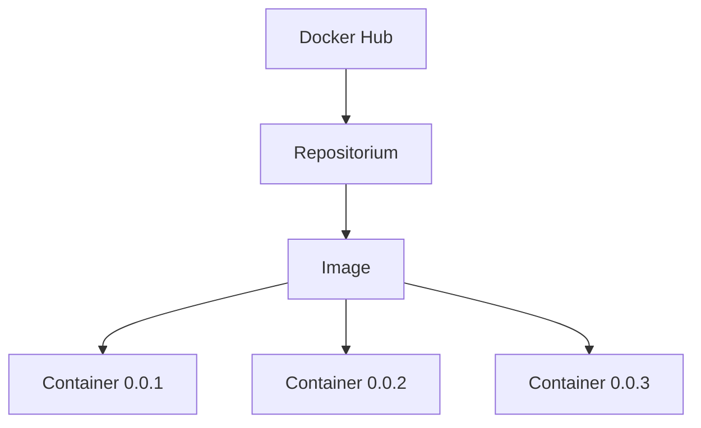

# DevOps tools
In this repositorium, I'm trying to learn tools for DevOps and understand their using purpose.

# Docker

We use Docker for running some applications in containers. Users shouldn't prepare their own environment (downloading software, configure it, etc), but they can just download prepared image with requiered settings.

Docker is lightweight solution. Before it slow virtual machines were used. In Docker you should install Docker engine and containers will be deployed using resources from it. Containers are isolated from eaach other.

When the application stopped the container is shut down respectively.

Image - it is repositorium in the Docker Hub with specific settings. Container - it is "child from an image", from one image can be produced many containers. The next diagram can illustrate this relationship:

## Useful commands
Explanation of some commands:
- ``docker run [OPTION] [NAME]:[TAG]``  this command used for running container. If the image wasn't find locally it would be pulled from Docker Hub
  - **NAME** - name of the repositorium in the Docker Hub
  - **TAG** - version of the repositorium
  - **OPTION** - options of command `run`:
    - -p a:b (--publish a:b) - mapping ports, where a - host port and b - internal port of the container
    - -d (--detached) - helps to run container in the background mode
    - -m 512m (--memory) - uses specific amount of memory for the container, in this example it is 512 MB
    - -cpu-quota=50000 - gives limit for cpu power, in this example it is 50% of cpu power (max = 100 000)
- ``docker logs [OPTiON] [ID]`` this command shows logs info of the container
  - **ID** - ID number of the container
  - **OPTION** - options of command `logs`:
    - -f (--follow) - enter logs process and refresh actual logs
- ``docker ps [OPTiON]`` this command shows containers that are actually running
  - **OPTION** - options of command `logs`:
    - -a (--all) - shows all containers as well as running and stopped

Commands for **images**:

``docker image``
 - -inspect [ID] - shows image info
 - -history [ID] - shows all layers of the image
 - -remove [ID/NAME] - remove image

Commands for **cotainers**:

``docker container``
- -inspect [ID] - information about container (IP, port, image name, etc)
- -un/pause [ID] - unpause or pause a container
- -stop [ID] - stop a container with some time for ending some processes
- -kill [ID] - stop a container immediately without additional time for ending processes of the container
- -prune - deletes all inactive containers

Commands for **system stuff** and other:

``docker system``
- df - for showing docker disk usage
- events - refresh actual events
- prune -a - remove images

``docker network``
- ls - shows networks in the docker, e.g. bridge
- inspect [NAME] - shows detailed information about network, where NAME can be e.g. bridge
## Creating image

Example form for building image:
- FROM python:alpine - base laer of the image. The next layers  will be overlap on this one
- WORKDIR /app - creating and NAVIGATING to the application folder /app. So application files will be in one place
- COPY . /app - copying files from your current path (.) to the destination (/app)
- RUN pip install -r requirements.txt - running command in command prompt (in this example installing python package from the requirements file)
- EXPOSE 1234 - exposing port 1234
- CMD python ./main.py - startng application running python file launch.py

!!! Also instead of using ``CMD python ./main.py`` you can use command ``ENTRYPOINT ["python", "/main.py"]``. The differenc of these commands is that the first one can be replaced bu putting any command after ``run`` (like ping site.com). But for the second command, you should use option ``--entrypoint [COMMAND]`` for replacement. The second variant is more prefered. 

To build image, go to the folder witth Dockerfile and run the next command:

``docker build -t [NAME]:{VERSION} .`` - where name and version mean name of the image and version respectively

To push your created image on the Docker Hub you can  run the command:

``docker push [NAME]:[VERSION]``

## Microservices

Microservice - it is small applicatio. Instead of deploying one monolit application user can split application with multiple microservice. The famous technology that can be introduced here called *Microservices chain*:

So you can imagine microservice simply like separete containers. By default they are not connected.

The first option of establish communication between containers is called bridge network. When you have 2 containers in the bridge network, you can use option ``--link [NAME_CONTAINER_1]`` when creating the second container. Also you need to specify global variable of the address on which your first cntainer can be availale, it looks like ``--env GLOBAL_VAR=*http://NAME_CONTAINER_1*``.

The second option called host network. But this option is not suitable if the user works on Mac or Windows.

And the third option is creating custom network. For this purpose you can use command ``docker network create [NAME]``. The next step is to create two container with a special option ``--netwok=[NAME]``, which means adding containers to this custom network. Global variable remains the same as it was in the first variant.

## Docker Compose

Is used in the situations when we have multiple containers and we need them communicate to each other. SO in simple words, all instructions that were written in the command prompt will be written in the one file *docker-compose.yml*.
The structure and dependednses of microservice in the .yml file you can see in the image below:

  

p
To run this file you can use a command ``docker-compose up (-d for the detached)``.

To stop and remove containers with network you can use command ``docker-compose down``.

Commands:
- ``docker-compose events`` - actual events
- ``docker-compose config`` - docker-compose.yml file architecture, helps to find type-mistake.
-  ``docker-compose images`` - shows images
-  ``docker-compose top`` - shows top processes, that are running in each container.
-  ``docker-compose stop, kill, un/pause`` - the same as for ``docker container``

