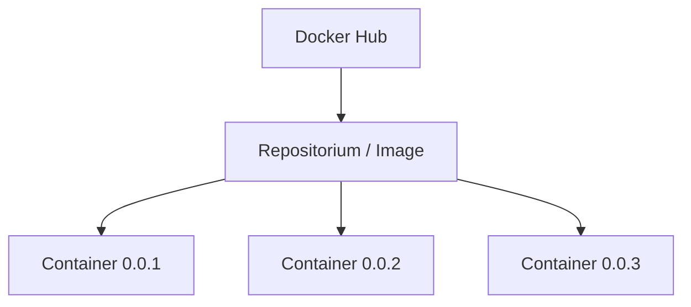

# DevOps tools
In this repositorium, I'm trying to learn tools for DevOps and understand their using purpose.

# Docker

We use Docker for running some applications in containers. Users shouldn't prepare their own environment (downloading software, configure it, etc), but they can just download prepared image with requiered settings.

When the application stopped the container is shut down respectively.

Image - it is repositorium in the Docker Hub with specific settings. Container - it is "child from an image", from one image can be produced many containers. The next diagram can illustrate this relationship:

## Useful commands
Explanation of some commands:
- ``docker run -p 1234:5678 [NAME]:[TAG]``  this command used for running container. If the image wasn't find locally it would be pulled from Docker Hub
  - **NAME** - name of the repositorium in the Docker Hub
  - **TAG** - version of the repositorium
